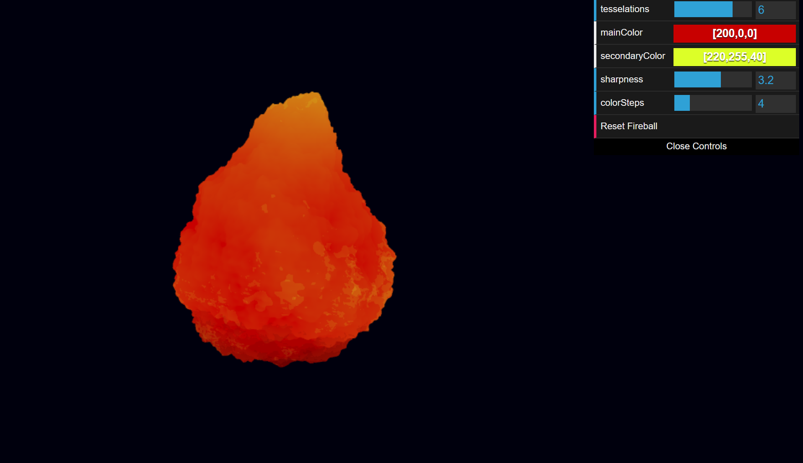

# [Project 1: Noise](https://github.com/CIS-566-Fall-2022/hw01-fireball-base)

Live Demo: https://kevinwd2401.github.io/hw01-fireball/

## Description

This scene comprises of a fireball made procedurally with a GLSL shader. The base sphere mesh is deformed through stretching, tapering with bias and gain functions, and then oscillated with trig functions. The chaotic appearance is radial displacement is driven by FBM Perlin noise scrolling upwards. Additional trig oscillations along the X and Z axes mimic a strong flame. The fragment shader applies discrete color banding, interpolated between two color parameters, by FBM noise and layered on top of base color gradient.

